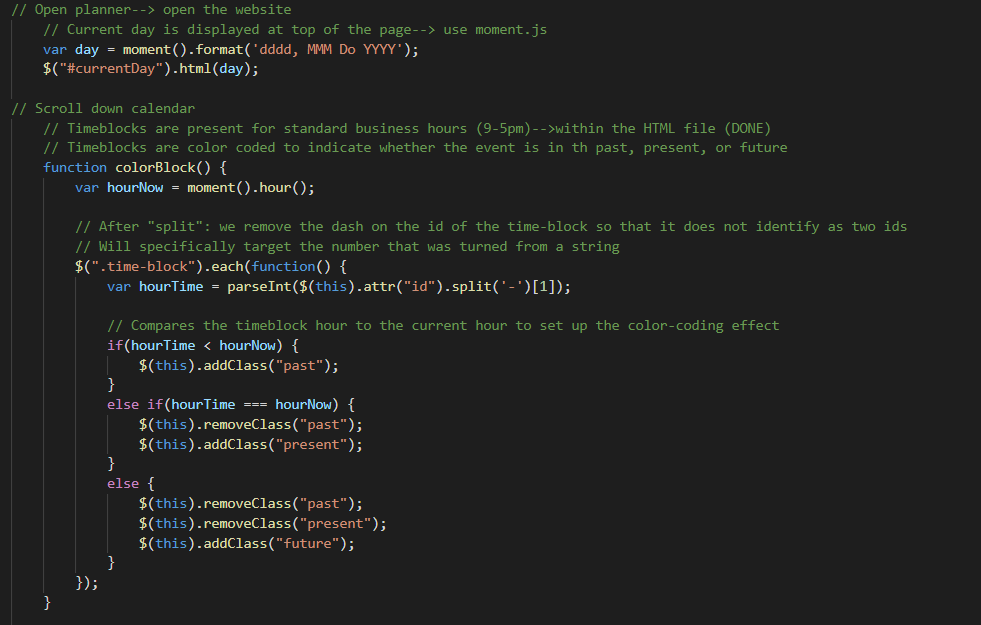

# far-too-busy

## Description

The goal of this project is to create a daily planner that will allow an user to manage their time effectively. When the planner is opened, the current day will be dsiplayed at the top of the planner. When the user scrolls down, timeblocks will be present for standard business hours (9am-5pm). Each timeblock will be color-coded to indicate if it is in the past, present, or futures. Events can be entered within timeblocks, and saved in the local storage. When the webpage is refreshed, the saved events will still be shown. 

For this project, the main objective is to create a daily planner with the given HTML and CSS files. As such, much of the work is completed within the newly-formed JavaScript file. No changes were made to the CSS file aside from comments.

Within the given HTML file, much of the work that is done is for the creation of the timeblocks. Since BootStrap was already linked, many `div` tags are used to build the timeblock layout. Within said `
` tags, "classes" and "ids" are used to denote the classification of the timeblock. Key elements within the HTML file include `<button>, class=row, and class= col`. Comments are written through out the HTML file. 

Within the JavaScript file, jQuery was heavily used. `moment().format()` is important as it allows for the current date to be dsplayed at the top of the webpage. `$(".saveBtn").on("click", function(){` uses jQuery to allow for the functional use of the save button; this later allows the event to be stored to the local storage. Lastly, a series of `if-else-if` statements are used to compare whether events are in the past, present, or future, and denotes the timeblock's color as such. Comments are written throughout the JavaScript file.

[Link to webpage](https://snehitak20.github.io/far-too-busy/)

## Technologies Used 
- HTML5
- CSS3
- JavaScript
    - jQuery

## Usage 
 
 To use this daily planner, pick the timeblock that the event will typed into. After writing in the event, click the save button. Use the refresh button, and the event will still be saved in that timeblock. 

 ## Installation 
 
1. Create a new repository on Github. 
    - Press the "+" sign on the top right hand corner, or the "new" button on your GitHub homepage. 
    - Create an unique name for your repository, and make the respository public. 
    - Click the "README" option to include the "README" page. 
    - Your new repository has been created.
2. Open GitBash (PC users) or Terminal (Mac users).
    - Navigate to where you want to clone your new repository onto your local machine. 
        - Use `cd` to help you navigate. 
3. To clone the new repository onto your local machine. 
    - Click the respository that you just made on github.com.
    - Click the "code" button and choose the SSH option. 
    - Copy the SSH option to your clipboard. 
    - On GitBash/Terminal, enter the command `git clone git@github.com:<UserNAME>/<demo-repo>.git`
        - After `git clone`, paste the SSH option from your clipboard into GitBash/Terminal.
        - Since the SSH option was used, enter the password for the SSH key when asked. 
4. You have now cloned your new repository.
    - Using `cd`, navigate into your new repository from the location that you have saved it in. 
    - Use `ls` to see what is inside the new repository currently. 
        - It should only include the README page as of now.
5. Tranferring the project files into your new directory on your local machine. 
    - Using Finder/Explorer, copy the corresponding files that are needed to edit your project. 
    - In another Finder/Explorer window, navigate to your new repository, and paste the files directly into that folder. 
6. On GitBash/Terminal, after pasting the project files into the new repository. 
    - Use `ls` to see what is now inside the new repository.
        - This should now include the README page, and the project files that you have copy-pasted in. 
7. Use `git status` to see if there any changes that need to be made to the repository. 
    - At this point, git will tell you that there is an untracked file .
8. Use `git add .` to add the new project files, and allow the new files to be tracked by git.
9. Use `git commit -m "add base project files"` to commit the changes have recently been made to the repository. 
10. Use `git push origin main` to sync your local machine with GitHub. 
    - Enter your SSH password when prompted. 
11. Use `code .` to open the files on a code reader of your choice.
12. Edit the files as necessary in your code reader. 
13. Periodically, and when you are finished with editing your code: 
    - Follow Steps 7-10 to keep your repository up to date with the changes that have been made. 
14. How to deploy the webpage:
    - After one final push to the repository, direct yourself to the repository's settings. 
    - Click the "pages" option from the sidebar. 
    - Select "main branch" as the source, and check that it selected for the "root" option. 
    - Click "Save" to deploy your webpage. 
    - *Give 5-10 minutes for the webpage to display the full contents.
15. You have successfully completed this project!

## Credits

Initial HTML and CSS files given by UC Berkeley Extension, Coding Bootcamp. 

## Reflection

For this project it was important to learn the use of jQuery and how it can be utilized within a JavaScript file. Additionally, it was important to learn hpw to utilize moment.js to display the current date. This project stands out because it is a functional daily planner that saves entered events. 

## License

Licensed under the [MIT](https://choosealicense.com/licenses/mit/#) license. 

